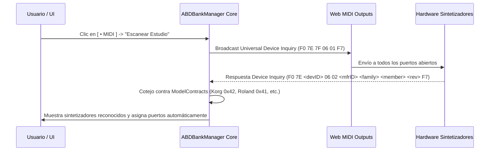

# Especificación de Enrutamiento Multi-Hardware y Gestión de Dispositivos MIDI

**Versión:** 1.1.0  
**Fecha:** 31 de Agosto de 2026  
**Autor:** Antigravity / DeepMind Pair Programming  
**Proyecto:** `ABDBankManager` (Librarian Standalone & Universal Engine)

---

## 1. Objetivo y Casos de Uso

Permitir que el usuario en modo **Standalone (App de Escritorio / Librarian)** pueda gestionar simultáneamente múltiples sintetizadores físicos conectados a diferentes puertos de interfaz MIDI, resolviendo:
1. **Múltiples Sintetizadores Distintos:** Ej. un *Korg MS2000*, un *Roland Juno-106* y un *Casio CZ-101* conectados al mismo tiempo en interfaces distintas.
2. **Sintetizadores Duplicados o Compatibles en Puertos Distintos:** Ej. tener a la vez un *Korg MS2000 (Teclado)* en el puerto `Focusrite MIDI 1` y un *Korg MS2000R (Rack)* en el puerto `MOTU MIDI 2`.
3. **Modo Plugin Embebido (Zero-Config):** Cuando se ejecuta dentro de un plugin anfitrión (`ABDMS2000`, `ABDCZ101`, etc.), la conexión se realiza de forma directa e interna vía `bridge` C++/JS con la memoria RAM activa, sin requerir puertos MIDI del sistema operativo.

---

## 2. Estructura de Datos: Matriz de Instancias Hardware (`DeviceBinding`)

Cada aparato físico configurado en el estudio del usuario se almacena en la tabla de persistencia local (`IndexedDB` / `Dexie`):

```typescript
export interface DeviceBinding {
  id: string;              // Identificador único (ej. "dev-korg-rack-01")
  name: string;            // Nombre descriptivo (ej. "Korg MS2000R (Rack Estudio)")
  modelId: string;         // ID del contrato del modelo (ej. "korg-ms2000r")
  manufacturer: string;    // Fabricante (ej. "Korg")
  inPortName: string;      // Nombre del puerto MIDI de entrada (ej. "MOTU MIDI Port 2 In")
  outPortName: string;     // Nombre del puerto MIDI de salida (ej. "MOTU MIDI Port 2 Out")
  midiChannel: number;     // Canal MIDI base (1..16, o 0 para Omni)
  deviceIndex?: number;    // Índice SysEx Device ID (ej. 0x00 para Korg Global Channel 1)
  isDefault?: boolean;     // Dispositivo preferido para este modelo
  lastSeen?: number;       // Timestamp de última detección
}
```

---

## 3. Estrategia de Descubrimiento y Detección Automática (Auto-Discovery)



1. **Auto-Discovery por SysEx Inquiry:**
   - Se envía `F0 7E 7F 06 01 F7` a todos los puertos de salida disponibles.
   - Las respuestas `06 02` (Device Inquiry Response) se parsean con los adaptadores de `ModelContract` para identificar fabricante y familia.
2. **Asignación Manual Asistida:**
   - Para sintetizadores clásicos (como el *Casio CZ* o *Juno-106* que no responden a Device Inquiry estándar), el usuario pulsa **`[ + Añadir Hardware ]`**, selecciona el modelo de la lista y asigna sus puertos de E/S.

---

## 4. Resolución de Destinos al Enviar y Capturar (Send / Fetch)

Cuando el usuario está en la vista de un modelo (ej. `Korg MS2000`):

1. **Si hay 0 dispositivos vinculados:**
   - Muestra aviso: *"No hay hardware vinculado. Haz clic en [• MIDI] para configurar puertos"*.
2. **Si hay 1 dispositivo vinculado para ese modelo:**
   - El botón `[ ▶ Enviar Banco ]` o `[ 📥 Capturar ]` opera de forma directa e inmediata contra ese dispositivo.
3. **Si hay 2 o más dispositivos del mismo modelo / familia:**
   - El botón de acción despliega un selector inteligente de destino:
     ```
     [ ▶ Enviar Banco  ▼ ]
       ├── 🎹 Korg MS2000 (Focusrite Port 1) [Por defecto]
       ├── 🎛️ Korg MS2000R (MOTU Port 2)
       └── ➕ Vincular otro dispositivo...
     ```

---

## 5. Vinculación Preferida por Banco (`bank.preferredHardwareId`)

Cada banco creado en la librería puede recordar a qué sintetizador físico del estudio pertenece:

```json
{
  "id": "bank-live-2026",
  "name": "Live Performance Bank",
  "modelId": "korg-ms2000",
  "preferredHardwareId": "dev-korg-rack-01",
  "patchCount": 128
}
```
Al hacer clic en *"Enviar a Sintetizador"*, el Bank Manager priorizará automáticamente la unidad de rack seleccionada para ese banco.

---

## 6. Coexistencia con Plugins Embebidos (`Host Plugin Mode`)

Cuando el Bank Manager se embebe dentro de un plugin anfitrión (`ABDMS2000`, `ABDCZ101`, etc.):
- `bridge.type === 'plugin-host'` toma máxima prioridad.
- La comunicación se enruta a través del `bridge` C++ directo con la memoria RAM activa del instrumento.
- No se bloquean puertos MIDI del sistema operativo, garantizando 100% de compatibilidad con DAWs (Cubase, Ableton, FL Studio, Logic, Reaper, Pro Tools).

---

## Apéndice A: Consideraciones de Implementación (Gaps y Mejoras Iterativas)

Los siguientes puntos son **mejoras recomendadas** para la implementación v1.1+. No son bloqueantes para v1.0.0, pero evitan fricción técnica futura.

### A.1 Persistencia Robusta de DeviceBinding ante Cambios de Puerto
- **Problema:** Windows renombra puertos MIDI al reiniciar (ej. \"Focusrite MIDI 1\" → \"Focusrite MIDI 2\"). Si solo se guarda inPortName/outPortName, los bindings se rompen tras reboot.
- **Solución:** Almacenar también portId (hash del MIDIPort.id de Web MIDI, si está disponible) y/o manufacturerId/productId/VID/PID via Web MIDI MIDIPort metadata. Al cargar, matchear primero por portId/VID/PID, fallback a nombre.
- **Migración:** Si el puerto físico cambió, mostrar toast: *\"Puerto MIDI del Korg MS2000 no encontrado. ¿Reasignar a puerto disponible?\"

### A.2 deviceIndex vs midiChannel — Separación Explícita
- **Actual:** deviceIndex?: number (SysEx Device ID, ej. 0x00 para Korg) y midiChannel: number (1..16, 0=Omni).
- **Aclarar:** Son independientes. Para Korg/DeepMind/Roland, deviceIndex se usa en el header SysEx (F0 <mfr> <devID>...). midiChannel se usa para Channel Voice messages (Note On/Off, CC).
- **Validación:** deviceIndex solo requerido para fabricantes que lo usen en SysEx (Korg 0x42, Behringer 0x20, Roland 0x41). Para Yamaha/Casio, típicamente no se usa.

### A.3 Detección de Conflictos de Puerto Compartido
- **Escenario:** Usuario vincula Juno-106 (outPort: \"Focusrite 1\") y DeepMind 12 (outPort: \"Focusrite 1\").
- **Validación UI:** Al guardar DeviceBinding, escanear existing bindings. Si outPortName coincide con distinto modelId, mostrar advertencia no bloqueante:
  > ⚠️ *Puerto \"Focusrite 1\" ya usado por Juno-106. SysEx simultáneo puede colisionar. ¿Continuar?*
- **Runtime:** Si se detecta colisión en envío SysEx concurrente, serializar envíos con cola y delay configurable (ej. 50ms entre mensajes).

### A.4 Export/Import de Configuración MIDI (Backup/Migración)
- **Feature:** File > Export MIDI Setup → genera midi-bindings.json con todos los DeviceBinding.
- **Formato:**
  `json
  {
    \"version\": 1,
    \"exportedAt\": \"2026-08-31T12:00:00Z\",
    \"bindings\": [ { ...DeviceBinding... }, ... ]
  }
  `
- **Import:** File > Import MIDI Setup → valida versión, matchea puertos por portId/VID/PID si existen, sino por nombre, y pregunta por conflictos.

### A.5 Timeout de Auto-Discovery Configurable
- **Actual:** Broadcast F0 7E 7F 06 01 F7 con timeout implícito.
- **Configuración:** Añadir en Settings > MIDI > Auto-Discovery:
  - 	imeoutMs: 500 / 1000 / 2000 (default 1000)
  - 
etryCount: 1 / 2 / 3 (default 1)
- **UX:** Para estudios con muchos dispositivos o cables largos, timeouts mayores evitan falsos negativos.

### A.6 Validación de midiChannel y deviceIndex en Tiempo de Ejecución
- Al enviar SysEx, validar que deviceIndex (si presente) esté en rango 0x00–0x0F.
- Al enviar Channel Voice (Note/CC), validar midiChannel en 1..16 (0 = omni → broadcast a todos).
- Log warning si valores fuera de rango: [MIDI] deviceIndex 0x12 inválido para Korg MS2000, usando 0x00.

### A.7 Test de Integración Sugerido (E2E)
- **Escenario:** 3 dispositivos virtuales (loopback MIDI): Korg MS2000, Juno-106, DeepMind 12.
- **Pasos:**
  1. Auto-discovery detecta los 3.
  2. Usuario vincula cada uno a su modelo.
  3. Crea banco con preferredHardwareId para cada uno.
  4. Envía banco a Korg → verifica SysEx recibido en puerto correcto.
  5. Envía banco a DeepMind con deviceIndex=0x02 → verifica header F0 00 20 32 20 ....
  6. Reinicia app → verifica bindings restaurados (migración si puerto renombrado).

---

*Fin del Apéndice A. Estas consideraciones se priorizan según feedback real de usuarios en v1.1+.*
