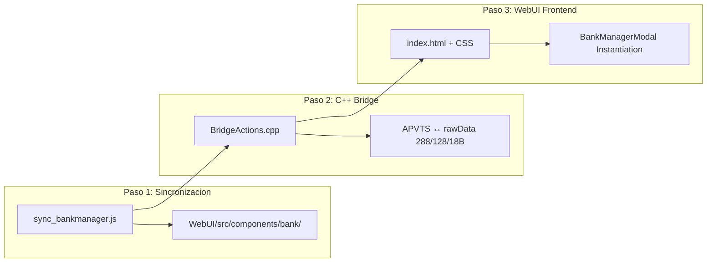

# Guía Técnica de Integración de ABDBankManager en Sintetizadores de la Suite

**Versión:** 1.0.0  
**Fecha:** 31 de Agosto de 2026  
**Autor:** Antigravity / DeepMind Pair Programming  
**Repositorio Principal:** `D:\desarrollos\ABDSynths\ABDBankManager`

---

## 1. Filosofía Arquitectónica y Patrón "Zero Forks"

**ABDBankManager** es la **fuente de la verdad (SSOT)** para la gestión de bancos, librerías, inspección Hex y volcados SysEx de toda la suite de sintetizadores ABD (`ABDMS2000`, `ABDCZ101`, `ABDJUNiO601`, `ABDEep`, `ABDPro008`, etc.).

### Principios Fundamentales:
1. **100% Gobernado por Contrato (`ModelContract`):** El motor no tiene ningún valor *hardcodeado*. Toda la topología (capacidad de banco, número de bancos lógicos, tamaño de patch en bytes, longitud de nombre, categorías y algoritmos SysEx) se obtiene dinámicamente del contrato del sintetizador solicitado.
2. **Sincronización Pre-Build (Patrón ABDKeyboard):** Los sintetizadores consumidores **no bifurcan (fork) el código**. Mantienen un script de sincronización (`npm run sync:bankmanager`) que copia los contratos y componentes limpios desde este repositorio antes de compilar.
3. **Theming Dinámico con CSS Custom Properties:** El componente visual (`BankManagerModal`) hereda automáticamente los colores, bordes y fuentes del sintetizador anfitrión y de sus skins activas.

---

## 2. Matriz de Contratos Disponibles

| Model ID | Nombre Comercial | Capacidad de Banco | Sub-bancos | Bytes / Patch | Máx. Nombre | Algoritmo SysEx / Checksum |
| :--- | :--- | :--- | :--- | :--- | :--- | :--- |
| `korg-ms2000` | Korg MS2000 / microKORG | 128 | 2 (A / B) | 288 B | 12 car. | 8-to-7 packing, `0x42` (Korg) |
| `casio-cz101` | Casio CZ-101 / CZ-1000 | 16 | 1 | 128 B | 0 car. | Nibble packing, `0x44` (Casio) |
| `casio-cz5000` | Casio CZ-5000 / CZ-1 | 64 | 4 (A / B / C / D) | 128 B | 0 car. | Nibble packing, `0x44` (Casio) |
| `roland-juno106` | Roland Juno-106 | 128 | 2 grupos (8x8) | 18 B | 0 car. | Octal `11..88`, `0x41` (Roland) |
| `behringer-dm12` | Behringer DeepMind 12 | 1024 | 8 (A a H) | 242 B | 16 car. | 7-to-8 packing, `0x00 0x20 0x32` |
| `behringer-pro800` | Behringer Pro-800 | 400 | 4 (0 a 3) | 100 B | 0 car. | CC-based dump, `0x00 0x20 0x32` |
| `yamaha-dx7` | Yamaha DX7 | 32 | 1 | 128 B | 10 car. | 7-to-8 packing, `0x43` (Yamaha) |

---

## 3. Receta de Integración Paso a Paso en un Sintetizador

Para integrar el Bank Manager en cualquier sintetizador (`ABDCZ101`, `ABDJUNiO601`, `ABDEep`, etc.), se siguen 3 pasos estandarizados:



---

### PASO 1: Script de Sincronización en el Sintetizador Consumidor

Crea el archivo `Scripts/sync_bankmanager.js` en el proyecto del sintetizador:

```javascript
import fs from 'fs';
import path from 'path';
import { fileURLToPath } from 'url';

const __filename = fileURLToPath(import.meta.url);
const __dirname = path.dirname(__filename);

const SOURCE_ROOT = path.resolve(__dirname, '../../ABDBankManager');
const TARGET_DIR = path.resolve(__dirname, '../WebUI/src/components/bank');

const COPY_MANIFEST = [
  // Contratos y adaptadores
  { src: 'Source/Contracts/ModelContract.ts', dest: 'contracts/ModelContract.ts' },
  { src: 'Source/Contracts/Models/index.ts', dest: 'contracts/models_index.ts' },
  { src: 'WebUI/src/contracts/modelContracts.js', dest: 'contracts/modelContracts.js' },
  { src: 'WebUI/src/contracts/gen/modelContracts.gen.js', dest: 'contracts/gen/modelContracts.gen.js' },
  
  // Motores Core
  { src: 'WebUI/src/core/libraryOperations.js', dest: 'core/libraryOperations.js' },
  { src: 'WebUI/src/core/sysexParser.js', dest: 'core/sysexParser.js' },
  { src: 'WebUI/src/core/hexDump.js', dest: 'core/hexDump.js' },
  { src: 'WebUI/src/core/fingerprint.js', dest: 'core/fingerprint.js' },
  { src: 'WebUI/src/core/exportEngine.js', dest: 'core/exportEngine.js' },
  
  // Componente UI
  { src: 'WebUI/src/components/BankManagerModal.js', dest: 'BankManagerModal.js' },
  { src: 'WebUI/src/components/BankManagerModal.css', dest: 'BankManagerModal.css' },
];

function sync() {
  console.log('🔄 Sincronizando ABDBankManager...');
  for (const item of COPY_MANIFEST) {
    const src = path.join(SOURCE_ROOT, item.src);
    const dest = path.join(TARGET_DIR, item.dest);
    if (fs.existsSync(src)) {
      fs.mkdirSync(path.dirname(dest), { recursive: true });
      fs.copyFileSync(src, dest);
      console.log(`  ✓ ${item.src} -> ${item.dest}`);
    }
  }
  console.log('✅ Sincronización completada.');
}

sync();
```

Añade en su `package.json`:
```json
"scripts": {
  "sync:bankmanager": "node Scripts/sync_bankmanager.js"
}
```

---

### PASO 2: Endpoints en C++ (JUCE / BridgeActions.cpp)

En el archivo `Source/Plugin/BridgeActions.cpp` (o equivalente del puente WebBrowser en cada sinte), implementa los dos métodos de intercambio binario:

```cpp
// 1. Extraer el sonido actual de los knobs / APVTS a un buffer binario
else if (action == "getRawProgramData")
{
    juce::String name = message.getProperty("name", "Active Patch").toString();
    auto rawBytes = processor_.extractPatchDataFromAPVTS(name); // Retorna std::vector<uint8_t> o std::array
    
    juce::MemoryBlock mb(rawBytes.data(), rawBytes.size());
    juce::DynamicObject::Ptr resObj = new juce::DynamicObject();
    resObj->setProperty("dataBase64", mb.toBase64Encoding());
    resObj->setProperty("name", name);
    resObj->setProperty("size", static_cast<int>(rawBytes.size()));
    sendEventToJs("rawProgramDataResponse", juce::var(resObj.get()));
}

// 2. Inyectar un buffer binario recibido del Bank Manager en el APVTS (Audición)
else if (action == "setRawProgramData")
{
    auto b64 = message.getProperty("dataBase64", "").toString();
    juce::MemoryOutputStream mem;
    if (juce::Base64::convertFromBase64(mem, b64))
    {
        processor_.applyPatchDataToAPVTS(static_cast<const uint8_t*>(mem.getData()), mem.getDataSize());
        sendFullParamSync(); // Notifica a los sliders y perillas del WebUI
    }
}
```

---

### PASO 3: Integración en el WebUI del Sintetizador

#### A. En `WebUI/index.html`:
```html
<!-- En <head> -->
<link rel="stylesheet" href="src/components/bank/BankManagerModal.css">

<!-- En la barra superior / menú -->
<button id="btn-open-bank-manager" class="nav-btn" title="Abrir Bank Manager">
  BANK MGR
</button>
```

#### B. En `WebUI/src/app.js`:
```javascript
import { BankManagerModal } from './components/bank/BankManagerModal.js';
import { bridge } from './bridge/bridgeCore.js';

let bankManagerModal = null;

document.addEventListener('DOMContentLoaded', () => {
  // Inicialización acotada por contrato al modelo del sinte
  bankManagerModal = new BankManagerModal({
    modelId: 'casio-cz101', // O 'roland-juno106', 'behringer-dm12', 'korg-ms2000'
    lockModel: true,        // Bloquea selectores y fija el layout nativo del modelo
    synthBridge: bridge     // Conecta con los endpoints de C++
  });

  // Botón para abrir el modal
  document.getElementById('btn-open-bank-manager')?.addEventListener('click', () => {
    bankManagerModal.toggle();
  });
});
```

---

## 4. Contrato de Theming CSS (Variables Dinámicas)

`BankManagerModal.css` utiliza variables CSS estándar con fallbacks. Cada sintetizador solo necesita definir sus variables en su propio `themes.css`:

```css
:root {
  /* Variables consumidas automáticamente por BankManagerModal */
  --color-bg-base: #0a1118;           /* Fondo exterior del modal */
  --color-panel-bg: #102130;          /* Fondo del contenedor principal */
  --color-panel-surface: #172d42;     /* Fondo de tarjetas de patches y cabeceras */
  --color-panel-border: rgba(0, 195, 255, 0.2); /* Bordes de paneles y cards */
  
  --color-accent: #00c3ff;            /* Color de acento primario y botones de acción */
  --color-accent-hover: #38d3ff;      /* Hover de botones y selección */
  
  --color-text-main: #f0f7ff;         /* Texto principal de patches */
  --color-text-muted: #7e9bb5;        /* Texto secundario, categorías y direcciones */
  
  --color-lcd-bg: #1c3322;            /* Fondo del display LCD de previsualización */
  --color-lcd-text: #54ff72;          /* Texto del display LCD */
  
  --font-lcd: 'Courier New', monospace; /* Tipografía para display */
  --panel-radius: 4px;                /* Radio de bordes */
}
```

---

## 5. Cómo Añadir un Nuevo Sintetizador al Ecosistema

Para soportar un nuevo sintetizador futuro:
1. Crea el archivo de contrato en `Source/Contracts/Models/mi-nuevo-sinte.ts`.
2. Define los campos obligatorios: `modelId`, `displayName`, `manufacturer`, `bankCapacity`, `banksCount`, `programsPerBank`, `patchDataSize`, `patchNameMaxLength`, `categories`, `defaultCategory`, `sysexManufacturerId`, `getProgramAddress`, `parseProgramAddress`.
3. Opcionalmente añade `buildPatchSysEx` y `buildBulkSysEx`.
4. Ejecuta `npm run generate` en `ABDBankManager`.
5. Ejecuta `npm test` para validar que cumple la suite de invariantes de contratos.
6. En el proyecto del nuevo sinte, ejecuta `npm run sync:bankmanager` y pásale su `modelId`.
